# Fractals
## by Cristian Ion
### The fractals in this repository belong to 4 catergories of generation methods:

#### Recursive
#### L-System
#### Iterative Function Systems
#### Complex Number Systems

## Recursive Fractals
### pythagoras_tree.py

### octo.py

## L-System Fractals
### dragon_curve.py
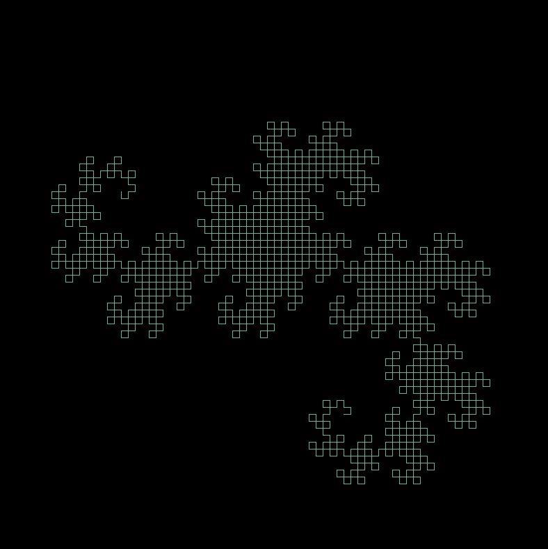

### l_sys_tree.py

### l_sys_sierpinksi_triangle.py
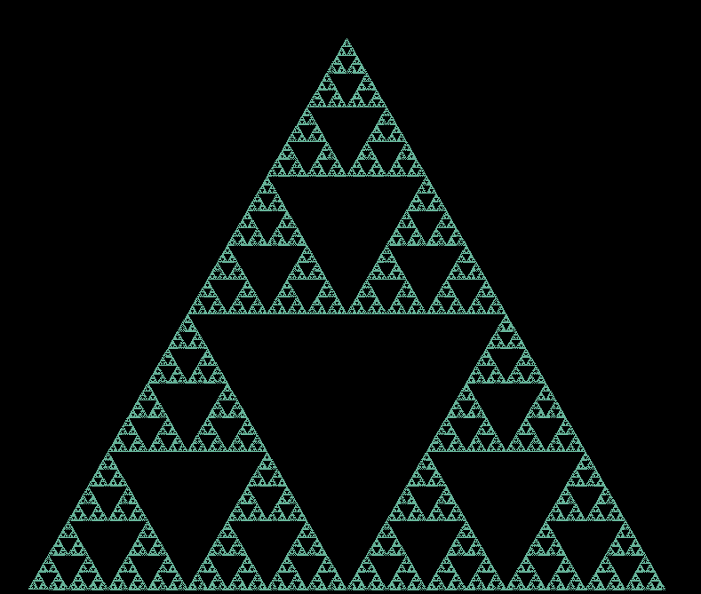

### quad_gosper.py

### fern.py
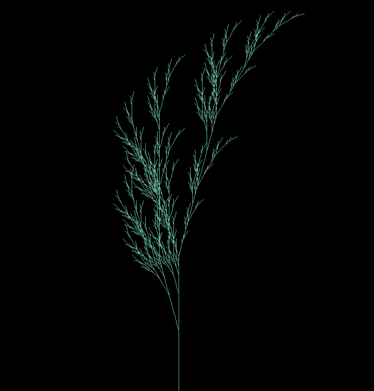

### animated_fern.py
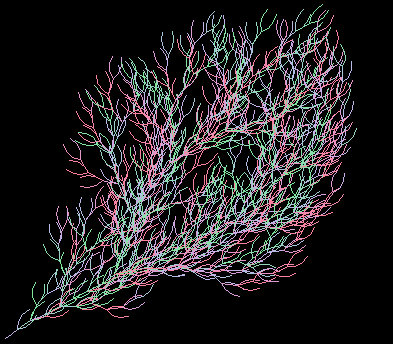

### animated_quad_gosper.py
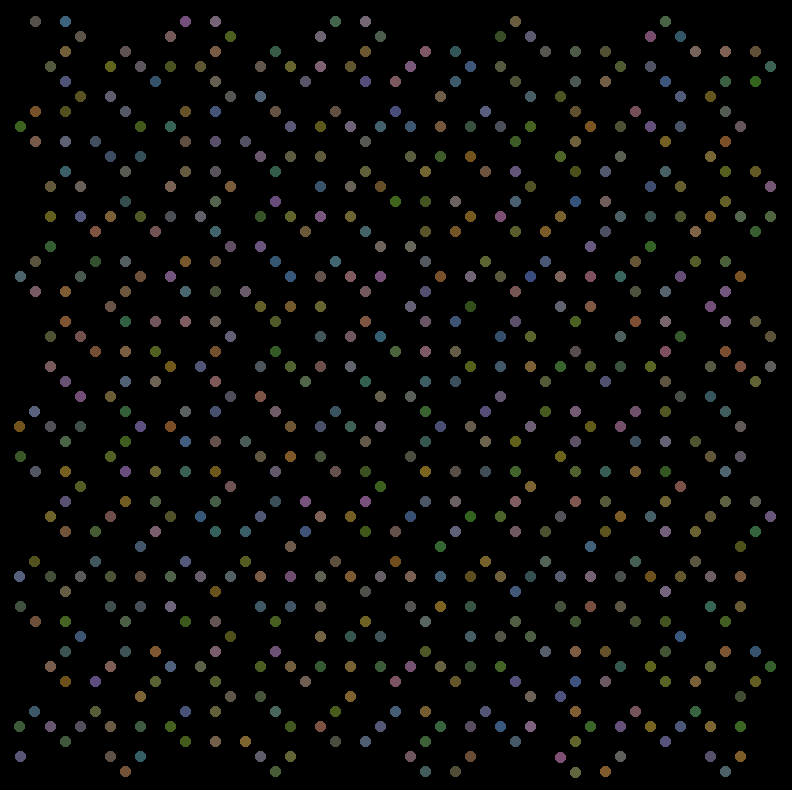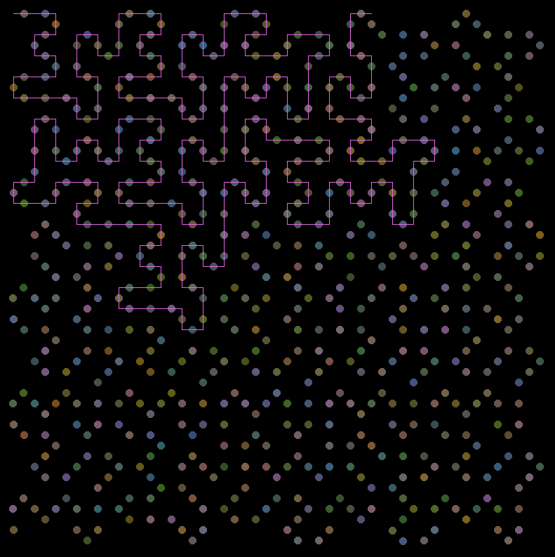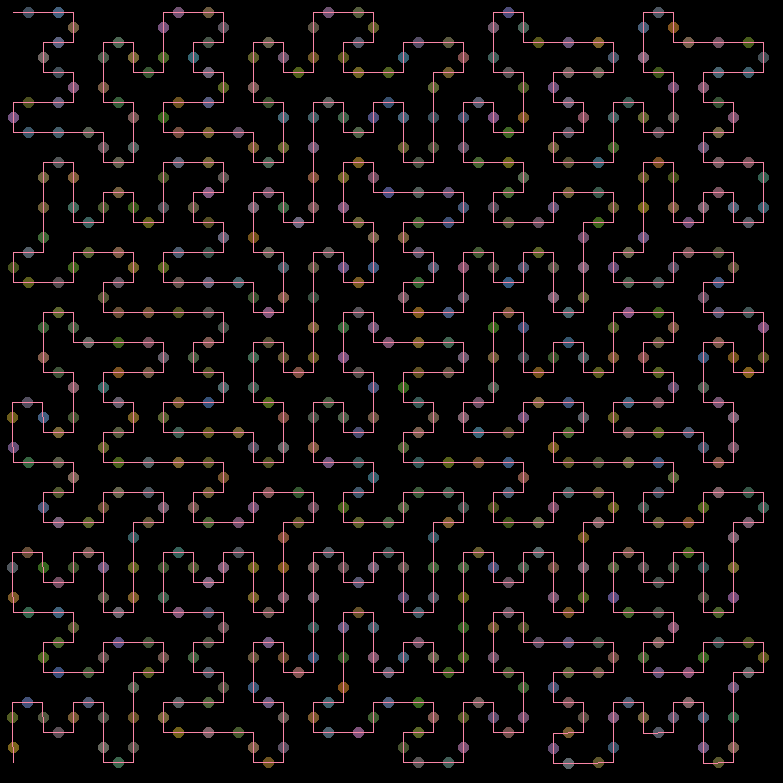

## Iterative Function System Fractals
### sierpinski_pentagon.py
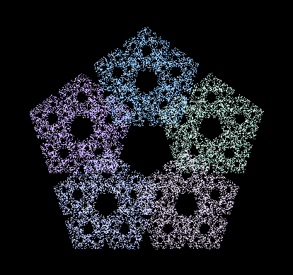

## Complex Number System Fractals
### mandelbrot.py
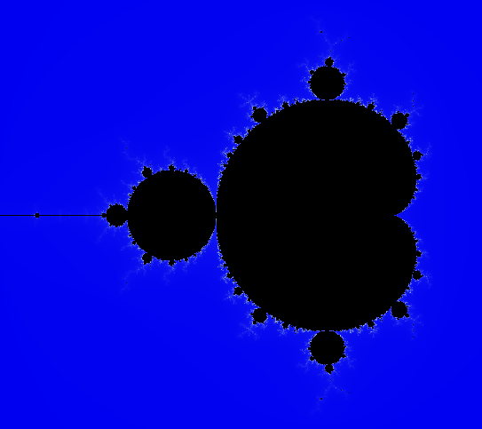

### butterfly_mandelbrot.py
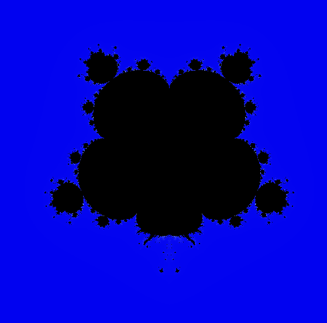

### trig_mandelbrot_julia.py
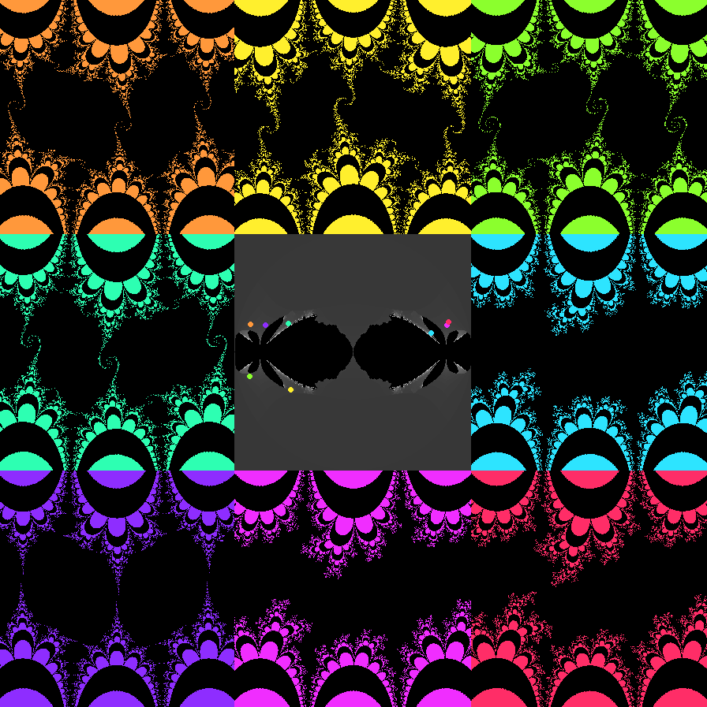
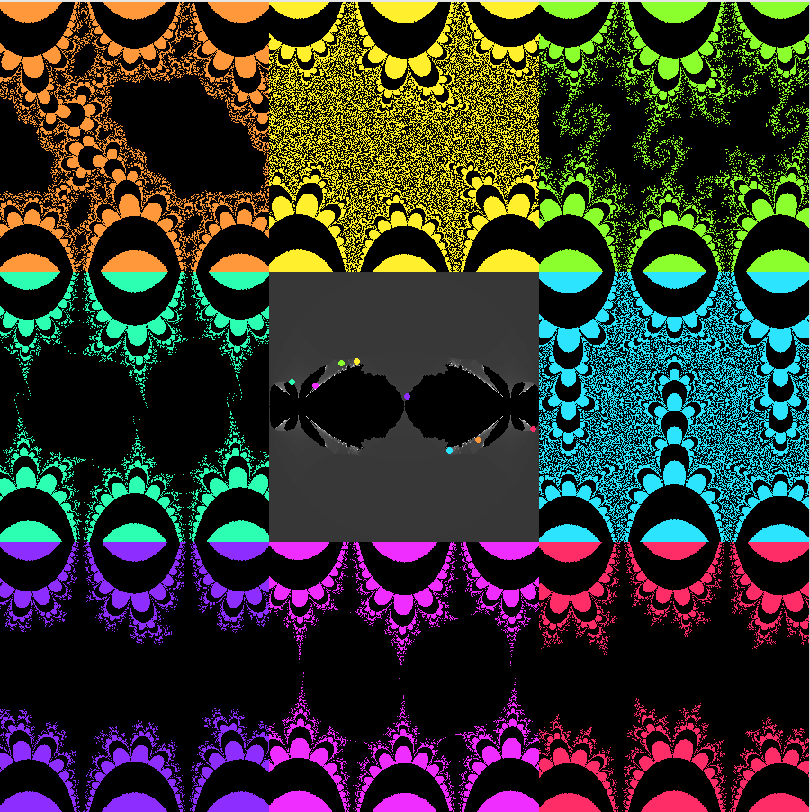

## Setup
Set up WSl2 in Linux

Install libx11-dev xserver-xorg-dev xorg-dev

